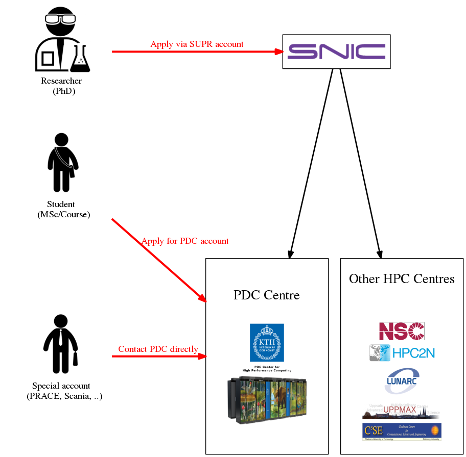

**In order to use PDC resources, you need**
- A PDC account.
- An allocation for PDC compute time.

## Accounts

There are two ways to apply for a PDC account:
- via the SUPR portal, [supr.snic.se](https://supr.snic.se/)
  - this is for all SNIC-managed projects
  - valid post address required for sending password
- via PDC [application form](https://www.kth.se/form/pdc-user-account-request)
  - this is for courses and special accounts (PRACE, Scania, ...)
  - valid post address and scan of passport required

 

## Allocations

All computing time allocations (except for courses) are managed in SUPR.

There are three categories of computing time allocations.

**Small allocations**
- Applicant can be a PhD student or more senior.
- Evaluated on a technical level only.
- Limits is usually 5,000 corehours each month.

**Medium allocations**
- Applicant must be a senior scientist in Swedish academia.
- Evaluated on a technical level only.
- On large clusters: up to 200,000 corehours per month.

**Large allocations**
- Applicant must be a senior scientist in Swedish academia.
- Need evidence of successful work at a medium level.
- Evaluated on a technical and scientific level.
- Proposal evaluated by SNAC twice a year.

|  **Description**       |  **Small allocation**     | **Medium allocation**  |  **Large allocation**      |
| ---------------------- | :-----------------------: | :--------------------: | :------------------------: |
Limit                    |  5K corehours/month       |  200K corehours/month  | Above 200K corehours/month |
Applicant requirement    |  PhD student or higher    | Senior scientist (Assistant professor or higher) | Senior scientist (Assistant professor or higher) |
Application evaluation   | Technical evalaluation | Technical evaluation      | Scientific and technical evaluation by SNAC twice a year. Evidence of successful work on a medium allocation. |

### Acknowledging SNIC
- All resources are free of charge for Swedish academia.
- Acknowledgement *are* taken into consideration when applying.
- Please acknowledge SNIC/PDC when using these resources.

**Acknowledge SNIC/PDC**
> The computations/simulations/[SIMILAR] were performed on resources provided by the Swedish National Infrastructure for Computing (SNIC) at [CENTERNAME (CENTER-ACRONYM)]

**Acknowledge people**
> NN at [CENTER-ACRONYME] is acknowledged for assistance concerning technical and implementation aspects [OR SIMILAR] in making the code run on the [OR SIMILAR] [CENTER-ACRONYM] resources.

