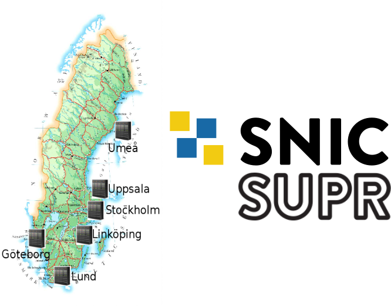
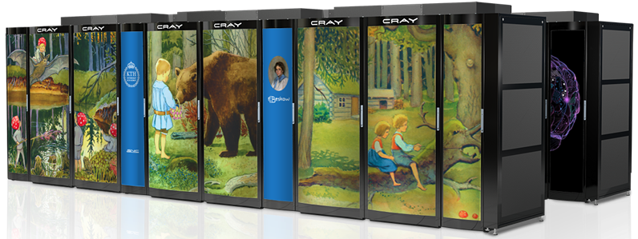
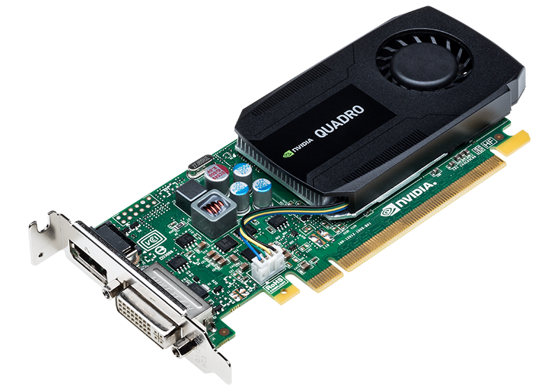

# Swedish National Infrastructure for Computing (SNIC) 

SNIC is a national research infrastructure which: 
 - Provides a balanced and cost-efficient set of resources.
 - Provides user support for large scale computation and data storage.
 - Aims to meet the needs of researchers from all scientific disciplines and from all over Sweden (universities, university colleges, research institutes, etc).
 
 

## SNIC user and project repository (SUPR)

- SUPR ([supr.snic.se](https://supr.snic.se/)) is the SNIC database of persons, projects, proposals and more.
- Most allocations of computing time in Sweden are managed via SUPR.
- After being allocated computing time at a SNIC cluster, users can apply for user accounts at the corresponding SNIC centers.

---

# PDC Center for HPC

## A peak back in time

| **Year**  | **Rank**  | **Procs.** | **Peak TFlops** | **Vendor** | **Name** | **Specs.** |
| --------- | --------- | ---------- | --------------- | ---------- | -------- | ---------- |
| 1994 | 341 | 256   | 0.0025 | Thinking Machines | Bellman | CM-200/8k |
| 1996 | 64  | 96    | 0.0172 | IBM | Strindberg | SP2/96 |
| 1998 | 60  | 146   | 0.0934 | IBM | Strindberg | SP P2SC 160 MHz |
| 2003 | 196 | 180   | 0.6480 | HP | Lucidor | Cluster Platform 6000 rx2600 Itanium2 900 MHz Cluster, Myrinet |
| 2005 | 65  | 886   | 5.6704 | Dell | Lenngren | PowerEdge 1850 3.2 GHz, Infiniband |
| 2010 | 89  | 9800  | 86.024 | Dell | Ekman | PowerEdge SC1435 Dual core Opteron 2.2GHz, Infiniband |
| 2010 | 76  | 11016 | 92.534 | Cray | Lindgren | XT6m 12-core 2.1 GHz |
| 2011 | 31  | 36384 | 305.63 | Cray | Lindgren | XE6 12-core 2.1 GHz |
| 2014 | 32  | 53632 | 1973.7 | Cray | Beskow | XC40 16-core 2.3GHz |
| 2017 | 36  | 67456 | 2440.0 | Cray | Beskow | XC40 18-core 2.1GHz |

## Current clusters at PDC

### Beskow - a Cray XC40 system

 

Was for a long time the fastest machine in Scandinavia (until late 2018 when Tetralith took over).

 - Lifetime: Q4 2020
 - 11 racks, 2060 nodes
 - Intel Haswell processor 2.3 GHz / Intel Broadwell processor 2.1 GHz
 - 67,456 cores - 32(36) cores/node
 - Aries Dragonfly network topology
 - 156.4 TB memory - 64(128) GB/node

### Tegner - pre/post processing for Beskow and GPU jobs

 

- Used for pre/post processing data 
- Has large RAM nodes
- Has nodes with GPUs
- Has two transfer nodes
- Lifetime: Q4 2020

**5 x 2 TB Fat nodes**
- 4 x 12 core Ivy Bridge, 2 TB RAM 
- 2 x Nvidia Quadro K420
  
**5 x 1 TB Fat nodes**
 - 4 x 12 core Ivy Bridge, 1 TB RAM 
 - 2 x Nvidia Quadro K420
  
**46 Thin Nodes**
- 2 x 12 core Haswell, 512 GB RAM 
- Nvidia Quadro K420 GPU

**9 K80 Nodes**
- 2 x 12 core Haswell, 512 GB RAM 
- Nvidia Tesla K80 GPU

## Support and system staff at PDC

**First-line support**
- Provide assistance to PDC users related to accounts, login, allocations etc.

**System staff**
- System administrators ensure that computing and storage resources run smoothly and securely.

**Application Experts**
- Assist researchers across different disciplines in developing and using scientific codes.
- Provide training.

## Training and other activites at PDC

**Summer School**  
- Introduction to HPC held in August every year (MPI, OpenMP, GPU, HPC architecture, profiling...)

**Various courses and workshops** 
- [HPC tools for the Modern Era (Oct 25-26 2018)](https://www.pdc.kth.se/about/calendar/pdc-prace-workshop-hpc-tools-for-the-modern-era-1.842504?date=2018-10-25&orgdate=2018-10-01&length=1&orglength=31)
- Programming with GPGPU
- Distributed and Parallel Computing 
- Cloud Computing
- Software Development Tools
- [Software Carpentry workshops](https://software-carpentry.org/)
- [CodeRefinery workshops](https://coderefinery.org/)

[**PDC Pub and Open House**](https://www.pdc.kth.se/about/calendar/prace-deep-learning-workshop-1.869408)
- Held in spring every year
- Users are invited to PDC to chat with the staff and see the clusters over drinks and snacks

**PDC Blog**
- PDC has recently launched a blog at <https://www.kth.se/blogs/pdc/>
- Subscribe if you want to receive new posts by email
- If you have suggestions/requests for new topics, please contact PDC support at 
  <support@pdc.kth.se>!

**PDC/SeRC seminar series**
- Monthly lunch-time seminars given by leading e-Science researchers on a wide range of topics

**Practical Deep Learning (March 20-21, 2019)**
- Practical introduction to deep learning, convolutional and recurrent neural networks, GPU computing, and tools to train and apply deep neural networks

**(Planned) Weekly open house**
- Bring all your HPC problems and discuss with the experts! Does your code 
  perform or scale badly? Is there something wrong with your batch script 
  but you can't fix it? Do you have an idea about what you want to do but 
  need help implementing it? PDC application experts can help.

All events can be found on the [events calendar](https://www.pdc.kth.se/about/events).

## Asking for support at PDC

PDC is well staffed to help new and old PDC users to perform their 
computational research efficiently. 

- Many questions can be answered by reading the web documentation:
  - <https://www.pdc.kth.se/support>
- Preferably contact PDC support by email: <support@pdc.kth.se>
  - You get a ticket number.
  - Always include the ticket number in follow-ups/replies, they look like this: [SNIC support #12345]
- Or by phone: +46 (0)8 790 7800
- You can also make an appointment to 
  [come and visit](https://www.pdc.kth.se/contact/travelling-to-pdc-1.736521).

### How to report problems

- Do not report new problems by replying to old/unrelated tickets. 
  Split unrelated problems into separate email requests.
- Use a descriptive subject in your email.
- Give your PDC username.
- Be as specific as possible.
- For problems with scripts/jobs, give an example. 
  Either send the example or make it accessible to PDC support.
- Make the problem example as small/short as possible. Provide all necessary information to reproduce the problem.
- If you want the PDC support to inspect some files, make sure that the files are readable.
- Do not assume that PDC support personnel have admin rights to see all your files or change permissions.

---

