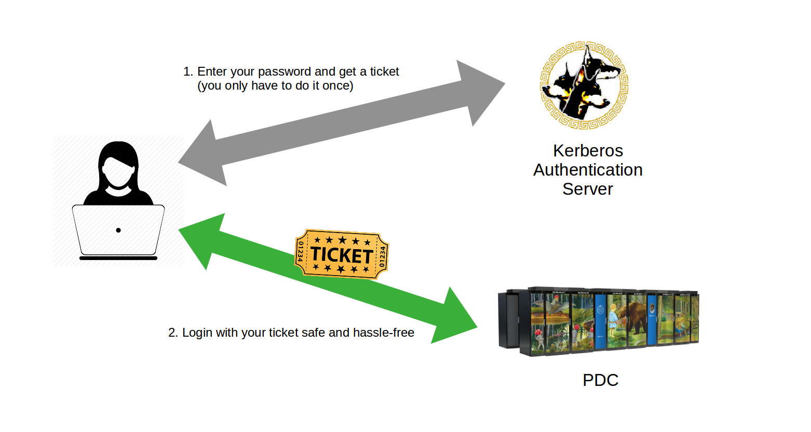

# Kerberos Authentication Protocol

PDC needs to protect the individual work and data of researchers who use PDC's systems, 
as well as protecting PDC's own hardware resources from security threats and attacks.
For this reason, PDC uses the Kerberos authentication protocol for secure login to PDC's clusters.

### What is it?

- Kerberos is a computer network authentication protocol with mutual authentication.
- PDC uses the Heimdal version of the open-source Kerberos software.
- Both the users of PDC and the PDC servers verify each other's identities using Kerberos. 
- Connecting using Kerberos protects against 
  [eavesdropping](https://en.wikipedia.org/wiki/Eavesdropping#Network_attacks) and 
  [replay](https://en.wikipedia.org/wiki/Replay_attack) attacks.

 

### Ticket

- Proof of users identity.
- Users use passwords to obtain tickets.
- Tickets are cached on the user's computer for a specified duration.
- Tickets **should be created on your local computer**.
- No passwords are required during the ticket's lifetime.

### Realm

- Sets boundaries within which an authentication server has authority (`NADA.KTH.SE`).

### Principal

- Refers to the entries in the authentication server database  (`username@NADA.KTH.SE`).
- Expires typically every two years, after which it needs to be reactivated.

