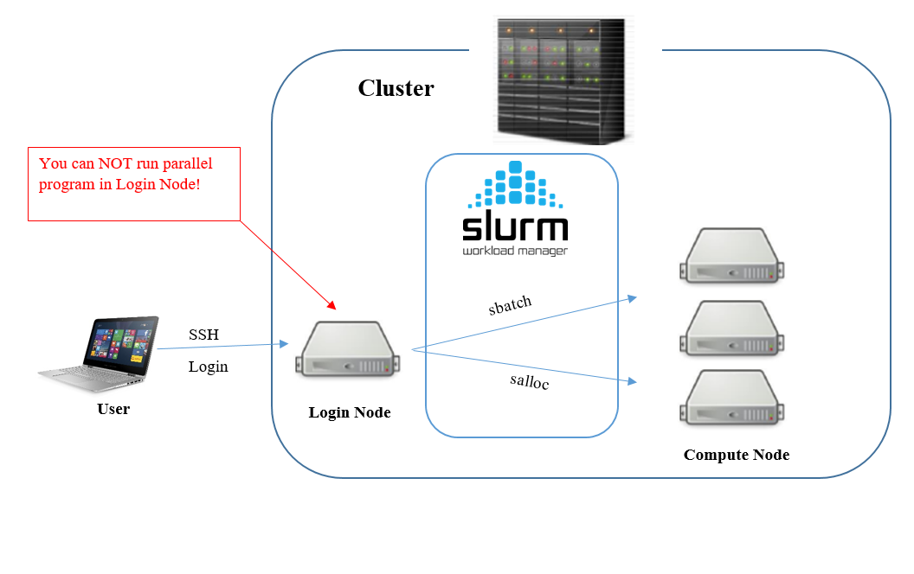

The computational resources on a supercomputer are shared simultaneously between 
hundreds of users. How can we avoid total anarchy and instead allocate resources 
in a fair way between all users, and at the same time ensure that the system 
is maximally utilized?

# Simple Linux Utility for Resource Management 

 

## What is SLURM?

SLURM is an open source, fault-tolerant, and highly scalable cluster management 
and job scheduling system:
- Allocates access to resources for some duration of time
- Provides a framework for starting, executing, and monitoring work on the set of allocated nodes.
- Arbitrates contention for resources by managing a queue

How does SLURM ensure that resources are shared in a fair and balanced way 
between competing users?   
The key quantity is the *Job Priority*, which SLURM computes based on
- **Age:** The length of time a job has been waiting.
- **Fair-share:** The difference between the portion of the computing resource 
  that has been promised and the amount of resources that has been consumed.
- **Job size:** The number of nodes or CPUs a job is allocated 
- **Partition:** A factor associated with each node partition

## How do we use the SLURM scheduler?

*Jobs* can be submitted to PDC clusters either by sending jobs to the job queue 
or by running interactively on a compute node.
- **Batch jobs:** 
- **Interactive jobs:**
