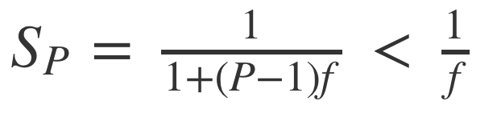
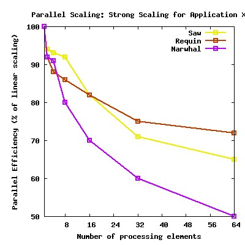
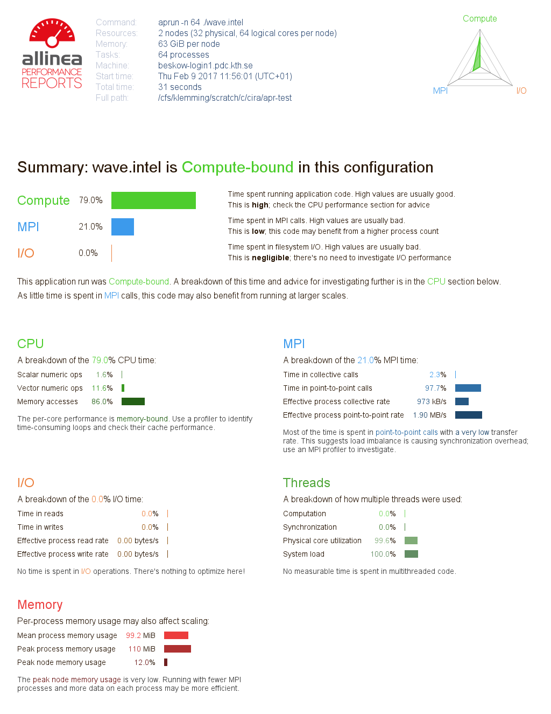

# Parallel scaling 

### [Ahmdahl's law](https://en.wikipedia.org/wiki/Amdahl%27s_law)

  Theoretical speedup is restricted by

   

  where _p_ is the proportion of execution time that is subject to parallelization, and _s_
  is the speedup of that part.

  > If a program needs 20 hours using a single processor core, and a particular part of the 
  > program which takes one hour to execute cannot be parallelized, while the remaining 
  > 19 hours (p = 0.95) of execution time can be parallelized, then regardless of how many 
  > processors are devoted to a parallelized execution of this program, the minimum execution time 
  > cannot be less than that critical one hour. Hence, the theoretical speedup is limited to at most 
  > 20 times (1/(1 − p) = 20). For this reason, parallel computing with many processors is useful 
  > only for highly parallelizable programs.

#### Strong scaling
- Defined as how the solution time varies with the number of processors for a *fixed total problem size*.
- Linear **strong** scaling if the speedup (work units completed per unit time) is equal to the number of processing elements used.
- Harder to achieve good strong-scaling at larger process counts since communication overhead typically increases with the number of processes used.

#### Weak scaling
- Defined as how the solution time varies with the number of processors for a *fixed problem size per processor*.
- Linear **weak** scaling if the run time stays constant while the workload is increased in direct proportion to the number of processors. 

### Parallel scaling performance measurements

 - It is almost always worthwhile to test how your job scales with number of processes.
 - Use a problem state or configuration that best matches your intended production runs.
 - Scaling should be measured based on the overall performance of the application.
 - Running a test:
    1. Run a series of jobs with varying number of nodes and threads
       - Ranging from 1 to the number of processing elements per node for threaded jobs.
       - Ranging from 1 to the total number of processes requested for MPI.
    2. Time how long it takes to complete (using wallclock time or equivalent).
    3. Measure multiple independent runs per job size.
    4. Measure using multiple computer systems if possible/relevant.
    5. Find the *sweet spot* where the scaling is still good and job finishes in reasonable time.

 

> adapted from [SHARCNET documentation](https://www.sharcnet.ca/help/index.php/Measuring_Parallel_Scaling_Performance)

 - **Play around with job parameters/algorithms/settings** and see if you can improve the parallel efficiency.

> ## Measure the scaling of a small program
>
> 1. Copy the C code for computing &pi; from 
> [here](https://pdc-web-01.csc.kth.se/files/support/files/scale.c)
> and paste to a file named `scale.c`. You can also do:
> ```bash
> [tegner]$ wget https://pdc-web-01.csc.kth.se/files/support/files/scale.c
> ```
>
> 2. Submit a job with a script containing the following lines
>
>    ```
>    module load gcc/7.2.0
>    gcc scale.c -fopenmp -o scale
>    
>    echo Strong scaling test
>    ./scale  1  10000000
>    ./scale  2  10000000
>    ./scale  4  10000000
>    ./scale  8  10000000
>    ./scale 16  10000000
>    ./scale 24  10000000
>    
>    echo Weak scaling test
>    ./scale  1  10000000
>    ./scale  2  20000000
>    ./scale  4  40000000
>    ./scale  8  80000000
>    ./scale 16 160000000
>    ./scale 24 240000000
>    ```
>
>    Here, `./scale` is followed by two numbers. The first one is the number of threads,
>    and the second one is the number of integration points.
>
> 3. Plot your results.
{: .challenge}

### Benchmark before you optimize

  > "We should forget about small efficiencies, say about 97% of the time:
  > premature optimization is the root of all evil." -- Donald Knuth

- Before attempting to optimize your own code, you should profile it!
- Typically, most of the runtime is spent in a few functions/subroutines, focus your optimization efforts on those.
- Excellent profiling tools (e.g. **ARM Forge**) exist, use them! 


# [ARM Performance Reports](https://www.arm.com/products/development-tools/server-and-hpc/performance-reports)

ARM Performance Reports (APR, formerly known as Allinea Performance Reports) 
is a convenient tool to characterize and understand the performance of HPC 
application runs. It generates a clear single-page HTML report answering the 
following questions: 
- Is this application well-optimized for the system it is running on? 
- Does it benefit from running at this scale? 
- Are there I/O or networking bottlenecks affecting performance? 
- Which hardware, software or configuration changes can we make to improve performance further?

> ## Generating a performance report
> 
> 1. Copy an example code from the Performance Reports installation 
>    directory:
>    ```bash
>    [tegner]$ cp /pdc/vol/allinea-reports/18.1.1/amd64_co7/examples/wave.c .
>    ```
> 2. Load modules for compiler, MPI library and ARM Perf-Reports:
>    ```bash
>    [tegner]$ module load gcc/7.2.0
>    [tegner]$ module load openmpi/3.0-gcc-7.2
>    [tegner]$ module load allinea-reports/18.1.1
>    ```
> 3. Compile the code:
>    ```bash
>    [tegner]$ mpicc  wave.c -lm -o wave.x
>    ```
>    The binary `wave.x` is now instrumented for ARM Performance Reports.
> 4. Submit the following batch script:
>    ```bash
>    #!/bin/bash -l
>    #SBATCH -A {{ site.allocation }}
>    #SBATCH -t 0:10:00
>    #SBATCH -N 1
>
>    module add gcc/7.2.0
>    module add openmpi/3.0-gcc-7.2
>    module add allinea-reports/18.1.1
>
>    perf-report mpirun -n 24 ./wave.x
>    ```
> 5. The job takes around 2 minutes to finish. When it's completed, open 
>    the generated html file in a browser (you may need to copy it to your 
>    local computer). A plaintext version of the results is found in the 
>    .txt file.
{: .challenge}

#### Understanding the performance report

After running an executable instrumented for ARM Performance Reports, 
an html file (along with a plaintext .txt file) is generated 
which looks something like this:

 
