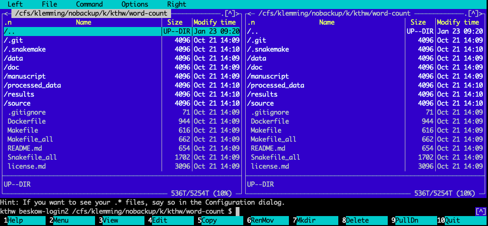

# HPC accessibility

Basic HPC usage hasn't changed much in decades - we still log in to 
clusters using secure shell, use terminals to execute UNIX commands, 
submit batch jobs to the job scheduler, etc. But there are alternative 
ways to interact with HPC systems, and there are also many ways in 
which traditional HPC usage can be made more convenient.

In this episode we will learn about methods and tools to customize 
and automatize the user interaction with an HPC system, in particular:

- Midnight Commander to manage files and directories
- `tmux` and `screen` to store terminal sessions
- Jupyter Notebooks to manage SLURM jobs

## [GNU Midnight Commander](https://midnight-commander.org/)

Midnight Commander is a visual free cross-platform orthodox file manager. 
It is a console application with a text user interface.

Midnight Commander is available at PDC:

```bash
$ module add midnightcommander
$ mc
```

This will open an in-terminal graphical interface where you can use both 
the keyboard and mouse.
 

## [GNU Screen](https://www.gnu.org/software/screen/) 

`screen` is a full-screen window manager that multiplexes a physical 
terminal between several processes, typically interactive shells
When `screen` is called, it creates a single window with a shell in it 
and then gets out of your way so that you can use the program as you 
normally would.  
With `screen`, you can:
 - Manage persistent terminal sessions, which survive if connection crashes 
   or if you need to abrubtly abandon your work.
 - Save screen processes when logging out and resume where you left off, 
 - Have multiple windows connected to the same terminal session.
 - Copy and paste (including block-copy) between different 
   screens without mouse.

**Screen commands short list**

| command | Explanation |
| ------- | ----------- |
| screen | start a session | 
| screen -S [name] | start a named session |
| screen -ls | list running sessions |
| screen -x | attach to a running session |
| screen -r [name] | attach to session with [name] |

The `screen` commands inside a screen session are prefixed by an 
escape key, by default `Ctrl-a` (`C-a`): 

| `screen` command | Explanation |
| ---------------- | ----------- |
| C-a d | detach from session |
| exit (C-d) | kill the window/session |
| C-a c | create new window |
| C-a C-a | change to last-visited window |
| C-a <number> | change to window by number |
| C-a " | see window list (and select) |

> ## Trying out screen
>
> The `screen` window manager can be really useful to preserve the state
> of a terminal session. Try the following steps:
> - Log in to Tegner, load a couple of random modules and export some 
>   random environment variables (e.g., `export foo=bar`).
> - Imagine that you need to catch the bus, but that you don't want to lose 
>   your environment. Start a screen session with `screen`.
> - Detach from your screen session with `Ctrl-a d`, and log out from Tegner.
> - Imagine that a day has passed, and log back in to Tegner.
> - List all screen sessions. Reattach to "yesterday's" screen session, 
>   and check that the environment is the same as when you left it.
> - If you have time, try playing around with screen some more, 
>   using the commands listed above or by finding inspiration from 
>   [online](https://www.rackaid.com/blog/linux-screen-tutorial-and-how-to/)
>   [tutorials](https://kb.iu.edu/d/acuy).
{: .challenge}


### [tmux](https://github.com/tmux/tmux/wiki) 
- [tmux](https://github.com/tmux/tmux/wiki) is similar to screen 
   with some minor pros and cons, try it out to see which one you like better!

## [Jupyter notebooks](https://jupyter.readthedocs.io/en/latest/)

Knowing Linux shell scripting makes life simpler when working in 
an HPC environment, but is it absolutely essential? Are there any other 
more high-level user interfaces out there?

PDC [offers the possibility of running Jupyter on PDC resources](https://www.kth.se/blogs/pdc/2019/01/using-jupyter-notebooks-to-manage-slurm-jobs/), and 
connecting to the running server from your own browser. 


> ## Configuring Jupyter on PDC
> 
> Before starting to use Jupyter at PDC, we have to make sure that the 
> connection between our browser and the Jupyter server running on the 
> Beskow/Tegner login node is secure. 
> 
> - **Go through the three configuration steps listed in [the software 
>   documentation page for Jupyter](https://www.pdc.kth.se/software/software/Jupyter-Notebooks/index.html) (choose either Beskow or Tegner)**
{: .challenge}

> ## Managing SLURM jobs from Jupyter
>
> With the help of a simple package installed into Python environments on 
> Beskow and Tegner, it is possible to submit and monitor 
> SLURM batch jobs and do light-weight pre- and postprocessing work, 
> as well as interactive on-the-fly analysis during a running job, from 
> within a Jupyter notebook.
>
> - **Go through the steps on [this PDC blog post](https://www.kth.se/blogs/pdc/2019/01/using-jupyter-notebooks-to-manage-slurm-jobs/). You will learn how 
>   to submit, monitor and interactively analyze a running job.**
{: .challenge}


