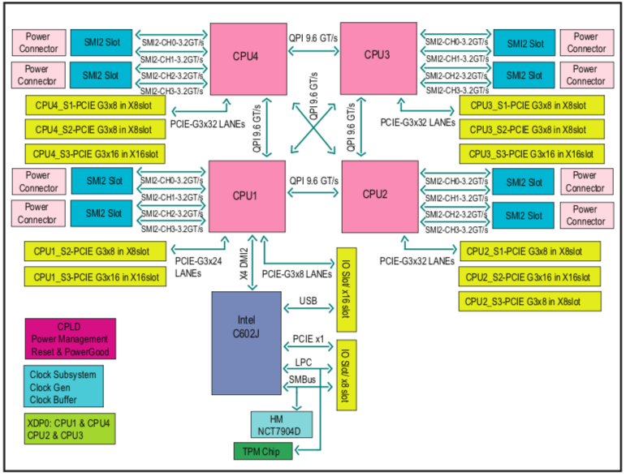
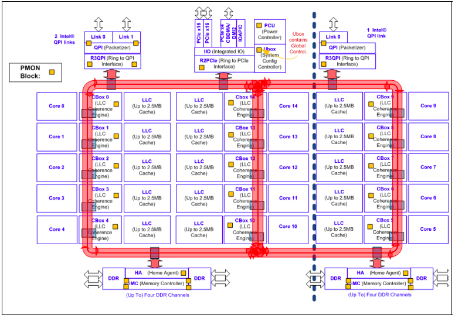

# Hardware specifics

## Beskow - a Cray XC40 system

 - 11 racks, 2060 nodes
 - Intel Haswell processor 2.3 GHz / Intel Broadwell processor 2.1 GHz
 - 67,456 cores - 32(36) cores/node
 - Aries Dragonfly network topology
 - 156.4 TB memory - 64(128) GB/node

## Tegner - heterogeneous pre/postprocessing and GPU cluster

- Heterogeneous system with 67 Supermicro nodes with Intel CPUs 
- Equipped with an EDR Infiniband interconnect

**5 x 2 TB Fat nodes**
- 4 x 12 core Ivy Bridge, 2 TB RAM 
- 2 x Nvidia Quadro K420
  
**5 x 1 TB Fat nodes**
 - 4 x 12 core Ivy Bridge, 1 TB RAM 
 - 2 x Nvidia Quadro K420
  
**46 Thin Nodes**
- 2 x 12 core Haswell, 512 GB RAM 
- Nvidia Quadro K420 GPU

**9 K80 Nodes**
- 2 x 12 core Haswell, 512 GB RAM 
- Nvidia Tesla K80 GPU

---

### Architecture of "fat nodes"

- 1 TB & 2 TB "fat-nodes" are Supermicro SuperServer 4048B-TRFT servers with standard 4-socket Intel IvyBridge configuration
- Each socket has an 12-core Intel Xeon E7-8857 v2 processor running at up to 3 GHz
- Manual for the motherboard of the server can be 
  [found here](https://www.supermicro.com/manuals/motherboard/C606_602/MNL-1802.pdf)

- Intel Xeon Processor E7-8800 v2 family Block Diagram:

#### Memory design

- The system is a NUMA system with one domain per socket.
- Each socket is directly connected via 3 Intel QuickPath Inteconnect links to 
  all the other sockets in the system.
- These links offer a bandwidth of 16 GB/s (8 GT/s) in each direction
  and are used for all coherent (e.g. memory read & write) and non-coherent 
  (e.g. I/O to a slot on a different socket) intra-socket traffic.
- Each socket has 4 links to memory buffers that in turn hold the
  memory modules (standard DIMM modules) 
  - each link has a bandwidth of 21.5 GB/s and the DIMM modules operate at a 
    clock speed of 1333 MHz.
- The 1 TB nodes have 4x8 32 GB modules and the 2 TB modes have 4x16
  32 GB modules.  
- Each socket has also some PCIe I/O links and in Tegner the single 
  Infiniband HCA (NIC) card is inserted into one
  16-lane Gen-3 (8 GT/s) slot on socket 1, thus access to it is asymmetrical.

#### Cache

- The nodes have a typical Intel three level cache hierarchy:
  - L1 and L2 are private to each core 
  - L3 is shared
- L3 cache on Tegner is 30 MB per socket 
- L1 cache is split 32 kB data + 32 kB instruction
- L2 cache is unified 256 kB per core 
- Best case latencies and associativity can be found in the 
  [optimization manual](https://software.intel.com/sites/default/files/managed/9e/bc/64-ia-32-architectures-optimization-manual.pdf). 
- Caches a kept coherent using a snoop-based MESI protocol, memory in remote 
  nodes is accessed via the QPI links.  
- Cache line size is 64 Bytes in all levels.

> ## Exploring the hardware of a node
>
> Use the following commands to explore the hardware of a Tegner node:
> - `lscpu` - reports information about the cpu and processing units
> - `lshw` - reports detailed and brief information about multiple different hardware units such as cpu, memory, disk, usb controllers, network adapters etc (needs sudo to give full information)
> - `lspci` - lists out all the pci buses and details about the devices connected to them.
> - `free` - check the amount of used, free and total amount of RAM on system
> - `cat /proc/cpuinfo` - get cpu information
> - `cat /proc/meminfo` - get memory information
> - `hwloc-ls` - get some information on the actual running hardware and it's interconnections.
> 
> Try running these commands first on the login node, and then on a compute 
> node. Consider putting the commands in a batch script and submit it to 
> the SLURM queue, rather than booking an interactive node which will lock 
> out other users from the node.
{: .task}

---

